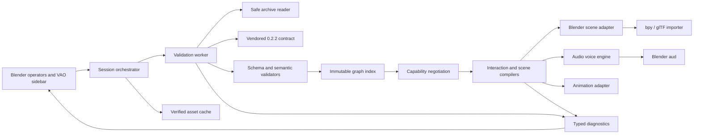
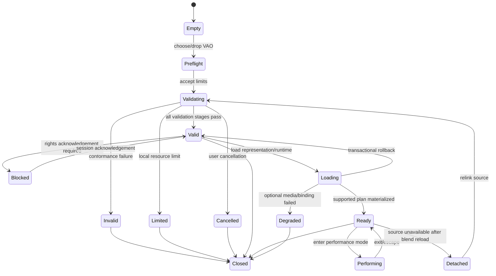

# Technical architecture

> Historical design record for the 0.2.0 implementation. The current 0.3.0
> release architecture preserves these trust boundaries but adds independent
> VAO 0.4.0/0.5.0 dispatch documented in [CONFORMANCE.md](CONFORMANCE.md); the
> implemented tree differs from the early planned layout below.

Status: historical implementation baseline
Applies to: VAO-Blender 0.2.0 design history
Primary runtime: Blender 5.1/5.2, Python 3.13

## 1. Architecture principles

1. **Validate before use.** Container, schema, semantic, fixity, and claimed
   profile checks finish before payload decoding or scene materialization.
2. **Keep validity separate from support.** A valid package can contain a codec,
   interaction, or required capability that this runtime cannot process.
3. **Compile, then execute.** Raw JSON and open relation graphs are converted to
   typed, immutable runtime plans. The audio/animation layer never queries the
   manifest ad hoc during an event.
4. **No implicit semantics.** Filenames, Blender names, collection order, and
   UI labels are never identifiers or behavior bindings.
5. **Blender-neutral core.** ZIP, contract, validation, graph, capability, and
   interaction compilation code does not import `bpy` or `aud`.
6. **Main-thread ownership.** Workers perform file I/O, hashing, JSON/schema
   work, and pure computation only. All `bpy` and `aud` object creation or
   mutation happens through the Blender adapter on the main thread.
7. **Read-only source.** The original VAO is never modified, normalized, or
   unpacked as a working directory.
8. **Transactional host changes.** A failed/cancelled load removes only the
   staging data and partial cache files created by that operation.

## 2. System view



The dependency arrows point inward toward the pure core. The core has no
knowledge of panels, RNA properties, Blender data-blocks, audio handles, or
viewport events. This permits fast standalone conformance tests and makes a
future non-Blender reader possible without copying validation logic.

## 3. Planned repository layout

```text
vao-blender/
  blender_manifest.toml
  __init__.py
  pyproject.toml
  src/vao_blender/
    registration.py
    preferences.py
    core/
      archive.py
      contract.py
      diagnostics.py
      graph.py
      model.py
      schema_validation.py
      semantic_validation.py
      capability.py
      interaction_compile.py
      scene_compile.py
      cache.py
      cancellation.py
    blender/
      properties.py
      session.py
      handlers.py
      operators/
        import_vao.py
        load_visuals.py
        performance_mode.py
        package_lifecycle.py
        diagnostics.py
      panels/
        overview.py
        explore.py
        play.py
        diagnostics.py
      gltf_bridge.py
      scene_adapter.py
      audio_engine.py
      animation_adapter.py
      control_surface.py
      keymaps.py
  contract/vao-0.2.2/
    release-metadata.json
    vao-manifest.schema.json
    vao-context.jsonld
    vao-vocabulary.ttl
    modavis-audio-loop.ttl
    CONTRACT_SHA256
  wheels/
  tests/
    unit/
    conformance/
    blender/
    fixtures/
    golden/
  scripts/
    build_extension.py
    run_blender_tests.py
    verify_contract.py
    generate_sbom.py
  docs/
```

The extension build may flatten or include `src/vao_blender` as a package, but
the checked-in tree preserves this separation. Imports inside the extension are
relative as required by Blender's extension guidance.

## 4. Domain model

The pure core uses frozen dataclasses or equivalent immutable records. JSON
objects are copied into immutable mappings after validation; the original
decoded manifest remains available for lossless inspection.

### 4.1 Primary records

| Record | Essential fields | Purpose |
| --- | --- | --- |
| `PackageDescriptor` | source, package ID, revision, format, manifest SHA-256, primary/focus IDs | Stable session identity |
| `EntityNode` | ID, kind, types, localized labels, classifications, external IDs, URI properties | Indexed graph node |
| `RelationEdge` | ID, subject, predicate, object/literal, status, scope, evidence, properties | Authoritative graph edge |
| `AssetRecord` | ID, path, media type, bytes, SHA-256, roles, status, subjects, properties | Indexed payload contract |
| `RightsRecord` | applicable IDs, license, statement, access condition, holder, credit | Runtime access decision input |
| `GraphIndex` | entity/asset/relation maps plus incoming/outgoing predicate indexes | O(1) identity resolution and stable traversal |
| `Diagnostic` | code, severity, stage, message, JSON pointer, archive path, related IDs | UI and JSON report item |
| `ValidationOutcome` | state, diagnostics, manifest, graph, asset verification map, profile results | Boundary between validation and runtime |
| `CapabilityReport` | capability IRI, claim status, implementation status, dependencies, reasons | Validity/support negotiation |
| `ScenePlan` | visual assets, selectors, frames, transforms, entities, animation targets | Input to Blender scene adapter |
| `InteractionPlan` | interaction ID/type, binding, domain, timing, state conditions, actions | Executable host-safe action plan |
| `VoicePlan` | gate, sample asset/hash, component, parameters, scoped relation IDs | One possible sample voice |

Identifiers remain full strings internally. Display labels never replace them.
All list ordering is deterministic: manifest order where semantically meaningful,
otherwise identifier order.

### 4.2 Diagnostic taxonomy

Stable codes use `VAO-<stage>-<number>`:

- `CNT`: container/path/compression/limit errors;
- `SCH`: JSON Schema errors;
- `SEM`: graph/reference/fixity/rights/profile errors;
- `CAP`: unsupported capability or media result;
- `GLT`: glTF/selector/coordinate result;
- `INT`: interaction compilation result;
- `AUD`: audio decode/runtime result;
- `LIF`: cache/session/lifecycle result.

Severity is `error`, `warning`, or `info`. A separate result class distinguishes
`invalid`, `resource-limited`, `unsupported`, `blocked-rights`, and `cancelled`;
these are not encoded by overloading severity text.

## 5. Session state and concurrency

### 5.1 State machine



`Invalid` means the package failed conformance. `Limited` means local policy
refused to process a package that may still be valid. `Degraded` means the
requested optional host operation failed after the package validated; required
runtime-plan failure keeps the session `Valid` but not `Ready`.

### 5.2 Worker boundary

- One `ThreadPoolExecutor(max_workers=1)` per active validation operation avoids
  random disk seeking and unbounded decompression concurrency.
- The worker owns `ZipFile`, hashing, JSON/schema/semantic validation, and pure
  plan compilation.
- It publishes immutable progress messages to a bounded queue. A
  `bpy.app.timers` callback polls the queue and updates UI properties.
- Cancellation uses a thread-safe token checked before each entry and after each
  bounded read chunk. It does not kill a thread inside a decompressor.
- The worker never calls `bpy`, `aud`, reports to an operator, or mutates RNA.
- Unregister and Blender file-load handlers request cancellation, stop polling,
  and join finished workers without blocking the UI indefinitely.

Progress reports stage, current entry/asset ID, entries completed, compressed
bytes read where available, expanded bytes verified, and total declared bytes.
UI updates are throttled to approximately 10 Hz.

## 6. Safe reader pipeline

The reader implements the sequence in the pinned VAO implementation guide:

1. Open the central directory without extraction; check configured entry,
   manifest, per-entry, total-expanded, and compression-ratio limits.
2. Reject encryption, duplicate/overlapping names, empty/dot/traversal path
   components, absolute/drive/UNC paths, backslashes, NUL, links, devices,
   sockets, special files, unsupported methods, and invalid UTF-8 names.
3. Apply case-fold collision rules, escalating to error for the preservation
   profile.
4. Require first-entry, uncompressed `mimetype` with exactly
   `application/vnd.modavis.vao+zip` and no BOM/newline.
5. Require `vao-manifest.json` at the archive root (and as the second entry
   for exact 0.2.2). Exact 0.3.2 additionally requires
   `META-INF/vao-carrier.json` and rejects every other non-payload member.
6. Decode the bounded manifest as strict UTF-8 JSON, reject duplicate JSON keys
   and non-finite numbers, inspect `formatVersion`, and dispatch only exact
   0.2.2 or exact 0.3.2.
7. Validate 0.2.2 with its pinned local validator and 0.3.2 with OrgRec's exact,
   checksum-pinned offline `Tools/vao03.py` plus `Tools/vaom.py`; there is no
   remote schema resolution or third-party schema-runtime dependency.
8. Apply the selected contract's semantic rules: unique IDs, reference resolution,
   primary/focus identity, relation shape/status, rights coverage, profile
   claims/capabilities, coordinate DAG/matrices/quaternions, time ranges,
   acoustics contracts, and every other rule implemented by the pinned
   conformance suite.
9. Match every `payload/` regular file to exactly one asset and vice versa.
10. Stream every asset once to validate declared byte size, ZIP CRC, and
    lowercase SHA-256. Nothing is decoded during this pass.
11. Build the graph index, negotiate capabilities, and compile requested plans.

Schema validation is not treated as semantic validation. The extension's
release gate compares results with VAOM over the positive and negative suite.

## 7. Contract packaging and upgrades

- `contract/vao-0.2.2` and `contract/vao-0.3.2` are copied from their exact
  authoritative bundles, not downloaded from W3ID at runtime.
- `CONTRACT_SHA256` records the release bundle checksum plus individual hashes.
- Enabling the extension verifies its packaged contract files once per install;
  mismatch disables VAO import with a clear installation-integrity error.
- `blender_manifest.toml` requests file access only. Version 0.2.0 requests no
  network, clipboard, camera, or microphone access.
- A contract update changes the vendored directory, tests, supported capability
  table, diagnostic baseline, and extension minor version together.
- The two compatibility lines coexist behind exact dispatch; 0.2.0 never
  rewrites or guesses a nearby manifest version.

## 8. Capability negotiation

Negotiation has three layers:

1. **Claim validity:** does the package satisfy the normative profile and
   required-capability rules?
2. **Static implementation support:** does this extension implement the
   capability, media type, selector, binding, and timing policy?
3. **Local availability:** did the decoder/import operator exist, did rights
   allow the action, and did resource/cache/device checks pass?

The report for a profile is supported only when every required capability is
valid and supported for this concrete package. Optional unsupported assets stay
in the inventory. Required behavior is never partially executed under a green
status.

Initial executable subset:

- `core-graph` and `fixity`: full reader support;
- generic model viewing: embedded GLB only, with resolvable visual bindings;
- playable `interaction`: per-package support when all interactions compile;
- `host-note-gate`: integer key domain, gate open/close, velocity domain
  retained even when the Cuntz UI uses a fixed velocity;
- selection: explicit independent or exclusive state known to the compiler;
- sample voice: one verified WAVE asset, accepted/reviewed parameters,
  `preserveRecordedPitch` or supported resample ratio, gain, linear/equal-power
  attack/release, no unresolved loop or recorded-release requirement;
- glTF animation actions with known clip and target selectors.

`sample-accurate` timing, arbitrary MIDI/OSC hardware, sample-region loops,
recorded release regions, arbitrary synthesis, external URLs, and acoustics
renderers are unsupported until a dedicated adapter and tests exist.

## 9. Scene compilation and Blender mapping

### 9.1 Collection topology

Each materialized package creates:

```text
VAO::<short title> [root collection]
  Representations
    <one child collection per visual asset>
  Controls
    <generated host UI proxy objects, if needed>
  Spatial
    <visible source/receiver pose helper empties for VAO 0.3.2>
  Diagnostics
    <optional non-rendering helpers, hidden by default>
```

The root collection stores host metadata only:

- `vao_package_id`, `vao_revision`, `vao_format_version`;
- `vao_manifest_sha256`, `vao_contract_sha256`;
- source-link status and sanitized source display name;
- materialization/session version.

Imported objects carry `vao_entity_ids`, `vao_asset_id`, asset SHA-256,
geometry-binding ID, selector kind/value, and a generated-vs-source flag. These
custom properties are traceability links, not new VAO assertions.

The exact validated manifest is stored read-only in a namespaced Blender Text
data-block for inspection and future relinking. Runtime services keep the typed
graph in memory. The Text block is not treated as a writable VAO workspace.

### 9.2 Transactional scene changes

- Model load creates a unique staging collection and records every data-block
  created by the Blender importer.
- Selector tagging, root transforms, and host organization occur in staging.
- Only after all required bindings resolve is staging linked under the final
  package root and renamed.
- Failure deletes only recorded staging data-blocks with zero external users.
  It never removes a name-matching user object.
- Visual load/removal operators are undoable. Background validation itself does
  not create geometry and is outside the undo stack.

### 9.3 glTF stable selectors

VAO geometry bindings may use glTF node indices or feature IDs; a glTF `name`
is not unique. Blender's importer does not provide a stable public mapping from
manifest node index to every created object. Version 0.2.0 therefore uses an
import shim:

1. Parse the already verified glTF JSON or GLB JSON chunk with strict bounds.
2. Create a cache-temporary copy and inject a namespaced
   `vao_blender_node_index` into each node's `extras`, preserving existing
   extras. For GLB, rebuild only container headers/JSON padding; binary chunks
   are copied unchanged.
3. Import the temporary derivative with `import_scene_extras=True` and
   `import_scene_as_collection=True`.
4. Resolve the injected extra to the declared binding, then store the original
   asset ID/hash and selector on the Blender object.
5. Delete the temporary derivative after successful import unless Blender still
   needs an external resource path.

The shim is explicitly a host import artifact, never an indexed VAO asset or a
claim that source bytes changed. Feature-ID selectors, skinned node edge cases,
and primitive-level selectors require separate adapters; a required unresolved
selector disables the dependent interaction.

### 9.4 Coordinates

The pinned validator checks the VAO coordinate-frame DAG, units, row-major
transforms, and normalized XYZW quaternions. Scene compilation produces one explicit matrix
from the bound VAO frame to the Blender package root.

The glTF importer already performs glTF-to-Blender axis conversion. The adapter
must not apply that conversion twice. It composes the declared child-to-root VAO
matrix with the inverse of Blender's glTF import basis, so the contract matrix
is realized exactly once. Source/receiver helper matrices also compose the full
declared position and XYZW orientation into the common root. The declared
matrices and frame/pose IDs are retained as trace metadata. Non-GLB formats
require separate adapters.

Unknown units/axes, singular transforms, cyclic frames, or a mismatch between
asset metadata and binding prevent a supported spatial/interactive plan. A user
may still choose an unbound visual preview with an explicit warning, but it is
not used for control picking or acoustic placement.

## 10. Interaction compiler

### 10.1 Compilation stages

1. Select active (`asserted`/`accepted` as defined by the contract) interaction
   entities and their URI-keyed type, protocol, domain, and timing properties.
2. Resolve outgoing activation/modulation, sample, animation, playback-parameter,
   tuning, loop, release, configuration, and evidence relations.
3. Convert relation scope and declared selection policy into explicit runtime
   predicates over `RuntimeState`.
4. Produce typed actions: `SetSelection`, `OpenGate`, `CloseGate`, `StartVoice`,
   `ReleaseVoice`, `StartAnimation`, `StopAnimation`, or a future registered
   host action.
5. Check every action against the implementation support table and applicable
   rights. Ambiguity is a compilation error, not first-match behavior.
6. Freeze the plan and expose a human-readable trace from control to every
   relation, component, sample, parameter set, and animation target.

### 10.2 Runtime state

`RuntimeState` contains only host/session facts:

- active selection/configuration IDs;
- pressed gate IDs and their velocity/value;
- voice handles owned by each gate;
- active animation actions;
- performance-mode input map;
- master gain, mute, and polyphony preference.

It is reset on package close, source detach, extension unregister, and Blender
file load. It is never serialized as evidence or written into the manifest.

### 10.3 Control surfaces

Preferred mouse picking uses geometry bindings from interaction/control entities
to imported glTF nodes. If the graph declares interactions but no pickable
visual control binding, the adapter generates a clearly tagged, non-rendering
`Controls` surface from the explicit control domains. It creates only the
declared keys/stops. Generated control geometry is host UI, not a representation
of missing physical parts.

The modal performance operator owns press/release event capture. Regular panel
buttons are suitable for stop toggles and single audition actions but are not
used to fake a sustained gate. Escape and loss of the valid 3D Viewport context
terminate the operator and release owned voices.

## 11. Audio engine

### 11.1 Voice creation

For each gate-open event, the compiler has already selected zero or more
`VoicePlan` records. The adapter:

1. resolves the asset through the verified cache;
2. creates/reuses `aud.Sound.file()` for that exact SHA-256;
3. applies supported source limiting only when declared and tested;
4. calls `aud.Device.play()` and stores the returned handle;
5. sets volume, pitch ratio, spatial position, and other supported handle
   properties from the plan;
6. schedules attack/release envelopes through the main-thread timer; and
7. removes invalid/stopped handles from the gate and LRU maps.

For chords/multiple selected stops, `aud.Device.lock()` brackets the shortest
possible set of `play()` calls and initial handle properties, then unlocks.
This improves simultaneous start but is not advertised as sample-accurate until
measured and proven.

### 11.2 Pitch and release

- `preserveRecordedPitch` uses ratio 1.0.
- `resampleToTarget` uses positive declared measured source fundamental and
  exact target frequency: `ratio = target / source`. No filename/MIDI default
  supplies a missing value.
- `disabled` does not instantiate a voice.
- Gate-close affects only handles owned by that gate unless the manifest defines
  another policy that the compiler explicitly supports.
- Attack/release curves are timer-controlled handle-volume ramps. The timer
  cadence and aud backend mean they are control-rate, not sample-accurate.
- Cuntz's legacy 0.3-second global fade is evidence for migration review, not a
  hard-coded runtime default. The golden manifest must state the accepted scope
  and release policy.

Version 0.2.0 does not claim arbitrary accepted loop-point or recorded-release
playback. A package requiring those features remains valid but not playable in
this runtime until the audio adapter implements and tests exact frame behavior.

### 11.3 Resource policy

- Default polyphony: 64 voices, configurable within a safe range.
- Voice stealing: stopped/releasing voices first, then oldest active voice;
  the event is reported as a runtime warning/metric.
- Sound factory cache: LRU keyed by asset SHA-256 with a default memory budget
  no greater than 512 MiB. Large files may remain streaming factories.
- No operation buffers the entire 3.68 GB Cuntz corpus.
- Stop all/fade all affects only handles created by this extension, never other
  Blender audio.

## 12. Animation adapter

- Only animation assets/roles and `drivesAnimation`/target relations from the
  compiled graph are eligible.
- glTF clip identifiers are resolved against the imported verified visual
  asset and stable node mapping.
- The adapter records original action/frame ranges and uses a package-owned NLA
  track or action assignment so cleanup is exact.
- Audio-authoritative synchronized performance is deferred unless the declared
  clock/transport policy fits the implemented timing adapter. Blender timeline
  frames are not silently treated as an audio clock.
- Unity `.anim`, controllers, scenes, prefabs, and C# remain visible source
  evidence only and are never imported as executable behavior.

## 13. Cache design

The writable root is obtained with
`bpy.utils.extension_path_user(__package__, path="cache", create=True)` or a
user-selected directory. The installed extension directory is never used as
writable storage.

```text
cache/
  v1/assets/<sha256>/<sanitized-original-name>
  v1/tmp/<operation-uuid>.partial
  v1/index.json
```

- Cache keys are content hashes, not archive paths or filenames.
- Extraction streams one validated member to a new `.partial` file, checks
  bytes/hash again, fsyncs where supported, then atomically renames it.
- Destination paths are chosen by the extension; archive names never become
  filesystem paths without sanitization.
- Existing cache entries are checked for regular-file type, size, and hash
  before use. Symlinks are refused.
- The default quota is 20 GiB. LRU eviction removes only entries not referenced
  by an active session and never deletes user-selected external directories.
- **Clear cache** lists the exact managed root and required confirmation. It
  never recursively targets a home directory, extension root, or unresolved
  preference value.
- Partial files are cleaned on startup and after cancellation/failure.

Full package validation still streams every payload asset from the source VAO.
A cached sample avoids repeated extraction/decoding, not the conformance pass.

## 14. Blender lifecycle

Registration owns a single registry of classes, menus, file handlers, keymaps,
timers, handlers, sessions, workers, audio device, and draw handlers. Teardown
runs in reverse ownership order and is idempotent.

Important handlers:

- extension unregister: cancel workers, exit performance modes, release owned
  audio, unregister timers/handlers/keymaps/classes;
- `load_pre`: stop runtime services before Blender replaces data;
- `load_post`: discover saved VAO root collections and mark them detached;
- package close: stop only that package's handles and release cache references;
- source relink: run the complete validation pipeline before reattaching.

No timer is persistent across file loads unless its lifecycle is explicitly
owned and tested. No background worker holds a `bpy` reference.

## 15. Dependency and extension packaging

The extension package contains:

- `blender_manifest.toml` using schema 1.0, semantic versioning, an SPDX license,
  platform list when binary wheels require it, file permission explanation, and
  Blender minimum 5.1.0;
- pure source plus vendored contract files;
- unmodified wheels for `jsonschema` and all transitive dependencies for every
  supported Python/platform tag;
- license notices, hashes, and generated SBOM.

Build gates:

```text
blender --command extension validate
blender --command extension build
blender --command extension validate <built-zip>
```

The build script fails for an unpinned dependency, missing wheel target,
contract checksum mismatch, unstated permission, or source file outside the
declared build set.

## 16. External implementation basis

The design follows current primary documentation:

- [Blender extension creation and manifest](https://docs.blender.org/manual/en/5.2/advanced/extensions/getting_started.html)
- [Blender extension Python wheels](https://docs.blender.org/manual/en/5.1/advanced/extensions/python_wheels.html)
- [Blender `FileHandler` drag/drop API](https://docs.blender.org/api/5.0/bpy.types.FileHandler.html)
- [Blender glTF import operator](https://docs.blender.org/api/5.2/bpy.ops.import_scene.html)
- [Blender audio (`aud`) API](https://docs.blender.org/api/5.0/aud.html)
- [Blender application timers](https://docs.blender.org/api/4.2/bpy.app.timers.html)
- [Python ZIP security and resource cautions](https://docs.python.org/3/library/zipfile.html)
- [Blender version compatibility/LTS policy](https://developer.blender.org/docs/release_notes/compatibility/)

The pinned local normative sources remain
[`VAO_STANDARD.md`](../../orgrec/Docs/VAO_STANDARD.md),
[`VAO_IMPLEMENTATION_GUIDE.md`](../../orgrec/Docs/VAO_IMPLEMENTATION_GUIDE.md),
[`VAO_CONFORMANCE.md`](../../orgrec/Docs/VAO_CONFORMANCE.md), and
[`vao-manifest.schema.json`](../../orgrec/Schemas/vao-manifest.schema.json).
Blender documentation informs host implementation; it does not override VAO
requirements.
