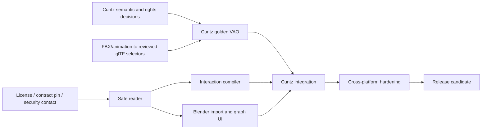

# Development plan

> Historical planning record for the initial 0.2.0 delivery. Current release
> gates and packaging commands are maintained in [RELEASE.md](RELEASE.md).

Status: proposed delivery plan  
Planning assumption: one primary Python/Blender engineer, with a VAO/domain
reviewer and rights/3D/audio contributors available at milestone gates  
Sprint assumption: two weeks

## 1. Delivery strategy

Development is organized around independently testable vertical gates:

1. establish legal/contract/content inputs;
2. build and cross-check a Blender-neutral safe reader;
3. materialize verified VAO visuals/metadata in Blender;
4. compile and execute Cuntz sample interactions;
5. add selector-driven viewport control and supported animations;
6. harden, package, and release.

The standalone reader and Cuntz content migration may advance concurrently, but
no Cuntz completion claim is possible until both converge on one golden package.
Exporter/editor work stays out of version 0.1.

## 2. Milestones

### M0 — Foundations and golden-package readiness

Estimated effort: 2–4 engineer-weeks plus rights/curatorial turnaround

Tasks:

- initialize version control and basic project governance when authorized;
- choose/approve the extension license, security contact, contribution policy,
  and permission to redistribute the pinned VAO contract and dependencies;
- copy the exact VAO 0.2.2 contract/fixtures into a checksum-verified vendor
  process (not by manual untracked copying);
- create `pyproject.toml`, test/lint/type configuration, deterministic diagnostic
  code registry, and CI skeleton;
- implement the extension packaging skeleton and validate a no-op build with
  Blender 5.1.1;
- audit Blender 5.1/5.2 Python/platform wheel tags and pin `jsonschema` plus
  dependencies;
- finish Cuntz content decisions C-01 through C-08 from the reference design;
- author/convert/pack the complete Cuntz golden VAO or establish a dated owner
  plan for any content gate that cannot finish inside M0;
- create the small redistributable playable-keyboard fixture.

Exit gate:

- contract files reproduce the pinned bundle checksums;
- Blender extension skeleton builds/validates and registers/unregisters cleanly;
- licenses/permissions are explicit enough for internal development;
- the synthetic fixture validates with VAOM;
- Cuntz source/golden work has named owners and no hidden semantic decision;
- public release is blocked if redistribution/security governance is unresolved.

### M1 — Safe standalone reader and conformance parity

Estimated effort: 3–5 engineer-weeks

Tasks:

- implement strict JSON loader, typed diagnostics, cancellation, limits, and
  progress records;
- implement central-directory/path/type/mimetype/root checks without extraction;
- integrate vendored JSON Schema 2020-12 validation with explicit formats;
- build immutable domain records and graph indexes;
- port/independently implement all applicable 0.2.2 semantic/profile checks;
- implement payload index cardinality and streaming size/CRC/SHA-256 verification;
- implement rights evaluation and capability/support result types;
- generate focused adversarial mutations;
- run result-parity comparison with pinned VAOM;
- expose a test-only standalone validation command that emits diagnostic JSON.

Exit gate:

- all pinned positives pass;
- all agreed mutations fail at the intended stage;
- no known validity disagreement with VAOM remains unexplained;
- cancellation and partial cleanup tests pass;
- core imports no `bpy`/`aud` and meets baseline streaming memory expectations.

### M2 — Blender import, overview, and graph exploration

Estimated effort: 3–4 engineer-weeks

Tasks:

- implement extension registration, preferences, file import operator, `.vao`
  FileHandler, session registry, worker bridge, and progress UI;
- add Overview, Explore, and Diagnostics panels with deterministic filters;
- implement rights acknowledgement state and action gating;
- implement managed cache, quota, extraction, tamper checks, and clear-cache
  safeguards;
- implement glTF/GLB extraction, node-index import shim, staging collection,
  selector binding, trace tags, coordinate root, commit/rollback;
- implement representation selection, frame/select/hide/show/remove actions;
- store validated manifest text and detached-source metadata;
- implement diagnostic JSON export with redaction;
- add Blender-background tests for registration, import, rollback, collisions,
  and two concurrent package sessions.

Exit gate:

- menu and drag/drop validation are responsive/cancellable;
- minimal model fixtures load with correct stable selectors and transforms;
- invalid packages create no geometry/cache residue;
- valid unsupported media stays inspectable;
- save/reopen produces a safe detached collection state;
- extension disable/re-enable is clean.

### M3 — Playable compiler and Cuntz audio runtime

Estimated effort: 4–6 engineer-weeks

Tasks:

- finalize URI/policy support table and immutable interaction/voice plan types;
- compile note-gate, independent/exclusive selection, scoped sample, component,
  and accepted playback-parameter relations;
- implement Play panel, selection state, audition, and plan trace UI;
- wrap Blender `aud`, implement verified sound-factory cache, gate-owned handles,
  pitch/gain, attack/release, device lock grouping, polyphony, voice stealing,
  and cleanup;
- implement modal computer-keyboard performance operator with auto-repeat and
  context-loss handling;
- implement generated interaction-board fallback from explicit key/selection
  domains;
- add fake-audio unit tests and real-backend generated-WAVE tests;
- integrate Cuntz golden package when available and fix only general compiler/
  adapter defects—never package-ID special cases.

Exit gate:

- synthetic keyboard executes exact declared voice matrix without filename use;
- unsupported loop/release/timing/binding prevents a false playable status;
- Cuntz produces 5 selection, 45 gate, and 225 voice plans;
- Cuntz single/multi-stop notes and overlapping chords have no stuck/cross-gate
  handles;
- exit, close, load new file, and unregister silence all owned voices;
- 30-minute randomized soak passes on the development host.

### M4 — Bound viewport interaction, animation, and spatial presentation

Estimated effort: 3–5 engineer-weeks

Tasks:

- ray-pick imported key/stop nodes through stable binding IDs in performance
  mode, with correct press/release ownership;
- show hover/pressed/selected host overlays without editing source materials;
- implement supported glTF clip/target resolution and package-owned NLA/action
  lifecycle;
- map validated poses/frame helpers and optional source positions for visual
  inspection only;
- implement graceful fallbacks between bound model control and interaction board;
- test duplicate glTF names, node order, feature-selector refusal, skinned
  models, animation cleanup, and multiple representations;
- complete Cuntz visual selector/dimension/orientation reference check.

Exit gate:

- every required Cuntz key/stop selector resolves or the documented fallback is
  used only where the graph permits it;
- audio-only vs animation-required interactions negotiate correctly;
- coordinate transforms are explicit and not double-applied;
- animation/timeline changes are fully reversible and package-owned;
- no Unity active content executes.

### M5 — Hardening and release candidate

Estimated effort: 3–4 engineer-weeks

Tasks:

- complete the security mutation suite and independent threat-model review;
- run memory, hashing, import, sample latency, polyphony, and long-soak baselines;
- close cancellation/race/teardown and cross-platform decoder defects;
- test Blender 5.1 and 5.2 LTS on macOS ARM64/x64, Windows x64, Linux x64;
- finalize extension manifest permissions/platforms/wheels/build exclusions;
- generate SBOM, dependency/contract hashes, license and third-party notices;
- write user installation, workflow, diagnostics, limitations, privacy, security,
  and troubleshooting documentation;
- build, validate, install-from-disk, uninstall, and revalidate the exact release
  artifact;
- perform the signed manual UI/audio/security and full Cuntz golden checklists.

Exit gate:

- every criterion in Product Spec section 8 and Test Strategy is evidenced;
- no open critical/high security, data-loss, stuck-audio, or validity-parity
  defect exists;
- supported platforms have recorded real audio checks;
- release notes use the private-snapshot implementation claim;
- exact source, contract, dependencies, tests, Cuntz golden metadata, and
  extension ZIP SHA-256 are archived.

## 3. Effort and calendar outlook

| Work | Engineer-weeks | Notes |
| --- | ---: | --- |
| M0 foundations/content gate | 2–4 | Rights/curatorial elapsed time may dominate |
| M1 standalone conformance | 3–5 | Largest correctness surface |
| M2 Blender view/explore | 3–4 | Includes glTF stable-selector shim |
| M3 playable/audio | 4–6 | Includes Cuntz matrix and real audio |
| M4 viewport/animation/spatial | 3–5 | Selector quality depends on content migration |
| M5 hardening/release | 3–4 | Cross-platform/manual work |
| **Total** | **18–28** | Roughly 5–8 calendar months for one engineer |

Two engineers can overlap M1 core with M0 Cuntz/model work, and later M2 scene
work with M3 compiler/audio work, but shared architecture and final integration
still need single-owner review. Estimates exclude a long rights decision or
major VAO schema revision.

## 4. Critical path and dependencies

The golden VAO is an input artifact, not something the Blender runtime should
repair. The reader can finish against small fixtures while content work proceeds.

## 5. Initial issue backlog

Create implementation issues in this order after repository initialization:

1. `GOV-001` Approve project/contract/dependency licensing and security contact.
2. `CNT-001` Vendor and verify VAO 0.2.2 bundle/checksums.
3. `BLD-001` Create Blender extension skeleton and deterministic build.
4. `TST-001` Import pinned fixtures and mutation generator.
5. `VAL-001` Safe central-directory and path preflight.
6. `VAL-002` Strict JSON + Draft 2020-12 schema validation.
7. `VAL-003` Graph/semantic/profile/fixity validation and VAOM parity.
8. `CUN-001` Resolve Cuntz graph selection/release/rights/model decisions.
9. `CUN-002` Produce reviewed glTF/animation derivatives and selectors.
10. `CUN-003` Pack/independently validate Cuntz golden VAO.
11. `BPY-001` Blender session/worker/progress/file-handler boundary.
12. `BPY-002` Cache and transactional glTF import shim.
13. `UI-001` Overview/Explore/Diagnostics panels.
14. `INT-001` Typed interaction/voice compiler and trace reports.
15. `AUD-001` `aud` adapter, envelopes, polyphony, lifecycle cleanup.
16. `UI-002` Play panel, modal keyboard, generated control surface.
17. `GLT-001` Viewport bound picking and animation adapter.
18. `REL-001` Security/performance/platform matrix and release evidence.

Each issue links the requirement IDs it implements and the tests that close it.

## 6. Review gates

| Gate | Required reviewers |
| --- | --- |
| Contract/conformance behavior | VAO contract owner/domain reviewer + implementer |
| Cuntz identity/stops/keys/selection/release | Organology/content owner + audio reviewer |
| Model selectors/coordinates | 3D specialist + domain reviewer |
| Rights/access handling | Rights holder/curatorial authority |
| Archive/cache threat model | Independent security reviewer |
| Audio interaction quality | Audio engineer/domain user |
| Public release artifact | Maintainer + independent installer/tester |

Review decisions are stored as ADR updates, golden-package paradata where they
change content, or signed release evidence. Slack/email memory is not the only
record.

## 7. Risk register

| Risk | Impact | Mitigation / trigger |
| --- | --- | --- |
| VAO 0.2 is private and changes | Rework or incompatible files | Pin checksum; isolate contract; no public stability claim; explicit upgrade project |
| No complete Cuntz VAO exists | No real end-to-end target | M0 golden-package work with named decisions/owners; synthetic runtime fixture in parallel |
| `selectsConfiguration` gap | Ambiguous stop/sample scoping | Contract review before authoring; no runtime-private predicate invention |
| Rights remain unknown | Playback/distribution blocked | Per-session local acknowledgement only where policy permits; keep golden artifact controlled |
| glTF importer loses stable node identity | Wrong part selection/animation | Import shim with node-index extras; duplicate-name tests; unsupported selector blocks required plan |
| 3.68 GB validation feels slow | Poor UX | Worker streaming/progress/cancel; benchmark; never skip full fixity for supported runtime |
| `aud` cannot implement exact loop/sample timing | False playable claim | Narrow support matrix; reject unsupported policies; dedicated future audio backend if justified |
| Blender API/version changes | Broken extension | Pure core; adapter isolation; 5.1/5.2 matrix; no unbounded max-version claim |
| Wheel/platform complexity | Failed install/security drift | Python 3.13 target; automated wheel-tag/license/hash verification and matrix builds |
| Add-on teardown races | Crash/stuck audio/files | Single owner registry, idempotent reverse teardown, active-work lifecycle tests |
| Cache deletion/path defect | Data loss | Marked managed root, content-addressed entries, exact-target validation, adversarial deletion tests |
| Model/Unity third-party mixing | Rights/semantic contamination | Source inventory classifications and intentional exclusion paradata |

## 8. Change control

A change requires an ADR and plan update when it affects:

- supported VAO compatibility line, profile, capability, media, selector,
  control binding, timing, or rights behavior;
- source mutation/writer role;
- network or another Blender permission;
- dependency or Python/Blender/platform baseline;
- validation order or any security/resource limit default;
- cache location/deletion policy;
- Cuntz golden graph counts/semantics or archive checksum.

Small UI wording and internal refactors do not need an ADR if requirements,
diagnostics, support outcomes, and test evidence remain unchanged.

## 9. Definition of done for implementation work

An issue is done only when:

- its requirement and decision references are clear;
- code is typed/linted and contains no unrelated changes;
- focused unit/adversarial tests exist and pass;
- Blender adapter work has background tests where feasible;
- diagnostics and unsupported/failure behavior are intentional;
- teardown/cancellation is covered for owned resources;
- user/security/developer docs are updated;
- no source VAO or Cuntz evidence bytes were modified in place;
- the reviewer can trace runtime output to the exact graph/asset inputs.

## 10. Post-0.1 roadmap (not committed scope)

Candidate increments, each requiring a new support contract:

- accepted frame-exact loop and recorded-release playback;
- physical MIDI 1.0/2.0 input via an optional backend;
- synchronized performance media/animation with an audio-authoritative clock;
- spatial audio scenes and supported renderer adapters;
- additional 3D selectors/formats and acoustic visualization;
- read-preserving VAO round-trip editor, then separately a writer/exporter;
- published VAO 1.0 migration once governance and namespaces stabilize.
